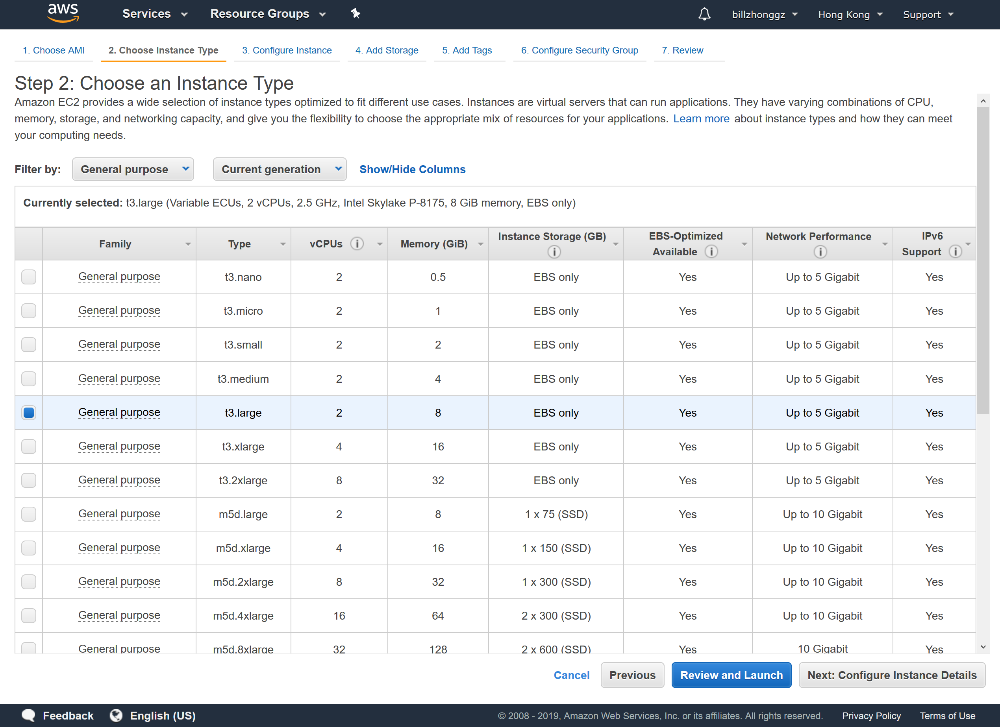
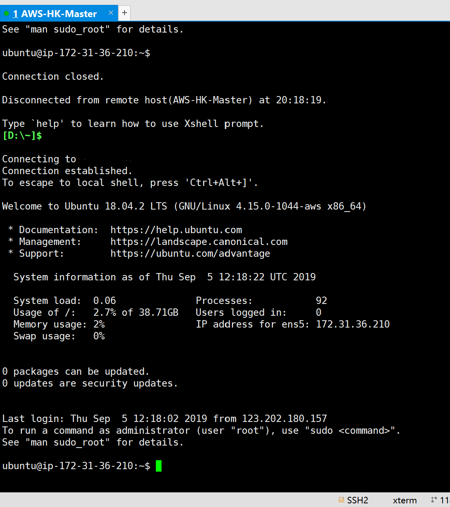
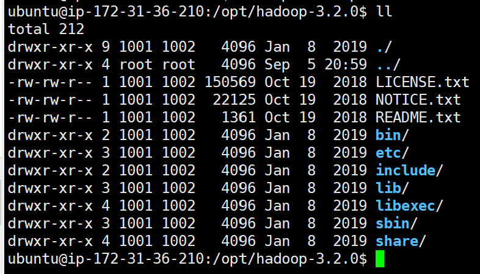
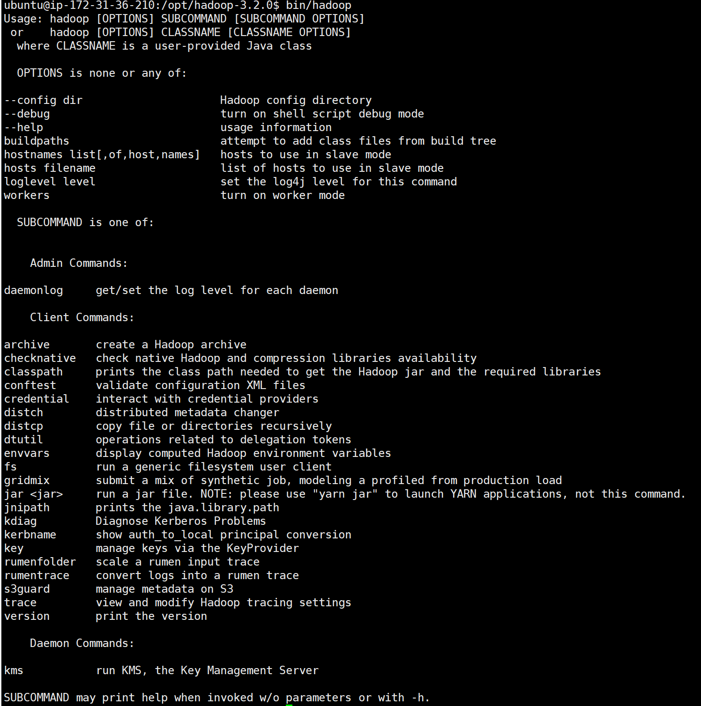
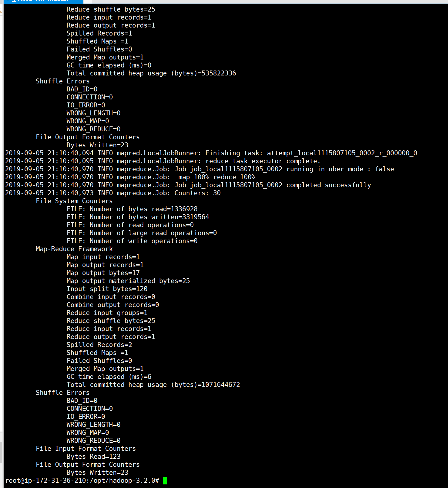
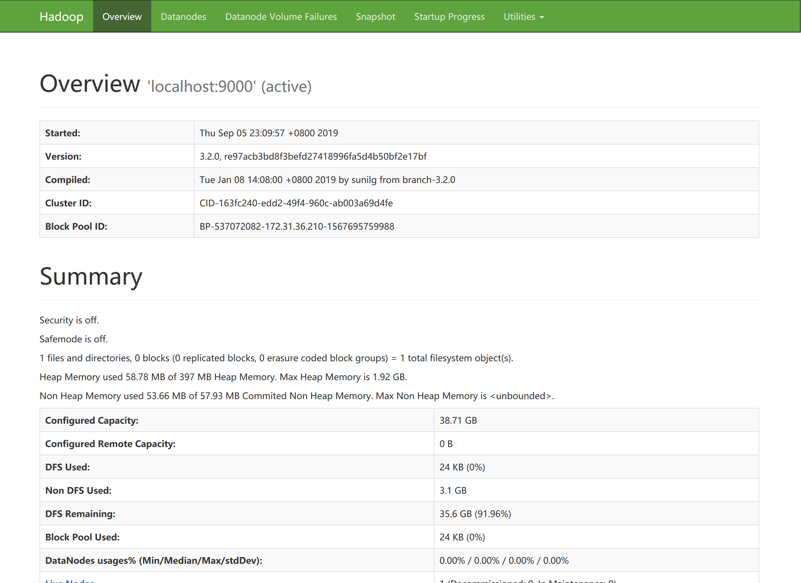
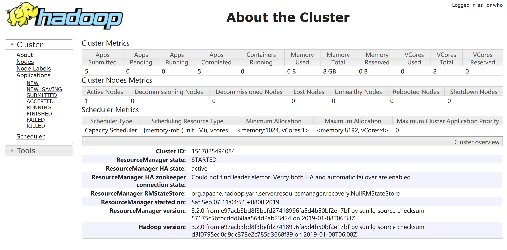

# IERG4300-Homework 0

- Name: ZHONG, Junru
- Student ID: 1155130306
- Sept 6, 2019

## Table of Contents

- [IERG4300-Homework 0](#ierg4300-homework-0)
  - [Table of Contents](#table-of-contents)
  - [Declaration](#declaration)
  - [Answers to the Questions](#answers-to-the-questions)
    - [1. Set up one Hadoop machine](#1-set-up-one-hadoop-machine)
      - [1.1 Allocating the virtual machine](#11-allocating-the-virtual-machine)
      - [1.2 Connect to the instance by SSH](#12-connect-to-the-instance-by-ssh)
      - [1.3 Install Hadoop's dependencies](#13-install-hadoops-dependencies)
      - [1.4 Download & install Hadoop](#14-download--install-hadoop)
      - [1.5 Run an example programme](#15-run-an-example-programme)
    - [2. Move to pseudo-distributed mode](#2-move-to-pseudo-distributed-mode)
      - [2.1 Change configuration files](#21-change-configuration-files)
      - [2.2 Generate a keypair for localhost](#22-generate-a-keypair-for-localhost)
      - [2.3 Start up the system](#23-start-up-the-system)
      - [2.4 Execute an example programme](#24-execute-an-example-programme)
      - [2.5 Start YARN](#25-start-yarn)
      - [2.6 Execute another example programme](#26-execute-another-example-programme)

## Declaration

I declare that the assignment here submitted is original except for source material explicitly acknowledged, and that the same or related material has not been previously submitted for another course. I also acknowledge that I am aware of University policy and regulations on honesty in academic work, and of the disciplinary guidelines and procedures applicable to breaches of such policy and regulations, as contained in the website <http://www.cuhk.edu.hk/policy/academichonesty/>.

## Answers to the Questions

- Section 1 and 2 are the answer to question 1

### 1. Set up one Hadoop machine

This is the **first part of the answer to question 1**. Following the instructions given by Hadoop official. <https://hadoop.apache.org/docs/r3.2.0/hadoop-project-dist/hadoop-common/SingleCluster.html>

#### 1.1 Allocating the virtual machine

In this moment, I have the AWS account ready. Now I need to set up one EC2 VM in t3.large size (2 vCPUs 8GB RAM), then log in to it by SSH. In this case, the operating system I chose is Ubuntu 18.04, which is the latest LTS version.



#### 1.2 Connect to the instance by SSH

I used XShell to connect the instance.



Then, do `apt update` and `apt upgrade` to keep the software latest. Since `GRUB` was upgraded, restart the instance.

#### 1.3 Install Hadoop's dependencies

Install `ssh` and `pdsh` by `apt`:

```shell
sudo apt install ssh pdsh
```

As Hadoop depends on Java, I used `apt` to install the `OpenJDK 8`.

```shell
sudo apt install openjdk-8-jdk
```

Then set the environment variable `JAVA_HOME` to the location of JVM.

```shell
# Add the following line to `/etc/environment`
JAVA_HOME=/usr/lib/jvm/java-8-openjdk-amd64/
```

> **Troubleshooting**
> Permanently add JAVA_HOME: <https://askubuntu.com/questions/175514/how-to-set-java-home-for-java>

#### 1.4 Download & install Hadoop

The current latest version of Hadoop is `3.2.0`. I used CUHK mirror to download Hadoop package, then extract.

```shell
wget http://ftp.cuhk.edu.hk/pub/packages/apache.org/hadoop/common/hadoop-3.2.0/hadoop-3.2.0.tar.gz
tar -zxvf hadoop-3.2.0.tar.gz
```

Now a list of Hadoop file can be seen under the directory.



Then run `bin/hadoop` for a installation check. The printed documentation shows that Hadoop is now successfully installed.



#### 1.5 Run an example programme

To fully test the installation, I ran an example programme. Inside the Hadoop home directory, type the following commands one by one.

```shell
mkdir input
cp etc/hadoop/*.xml input
bin/hadoop jar share/hadoop/mapreduce/hadoop-mapreduce-examples-3.2.0.jar grep input output 'dfs[a-z.]+'
cat output/*
```



### 2. Move to pseudo-distributed mode

This is the **second part of the answer to question 1**.

To move a single-machine based Hadoop to pseudo-distributed mode, only several configuration files need to be changed.

#### 2.1 Change configuration files

`etc/hadoop/core-site.xml`

```xml
<configuration>
    <property>
        <name>fs.defaultFS</name>
        <value>hdfs://localhost:9000</value>
    </property>
</configuration>
```

`etc/hadoop/hdfs-site.xml`

```xml
<configuration>
    <property>
        <name>dfs.replication</name>
        <value>1</value>
    </property>
</configuration>
```

#### 2.2 Generate a keypair for localhost

As my instance cannot be accessed without a keypair, I used the following command to generate a keypair and import it.

```shell
ssh-keygen -t rsa -P '' -f ~/.ssh/id_rsa
cat ~/.ssh/id_rsa.pub >> ~/.ssh/authorized_keys
chmod 0600 ~/.ssh/authorized_keys
```

#### 2.3 Start up the system

I used the command below to start up the Hadoop distributed file system with the script.

```shell
export PDSH_RCMD_TYPE=ssh  # Set PDSH parameter, refer to Troubleshooting below.
sbin/start-dfs.sh
```

> **Troubleshooting**
> PDSH rcmd permission denied: <https://stackoverflow.com/questions/42756555/permission-denied-error-while-running-start-dfs-sh>, add the environment variable also to `/etc/environment`.

I can see the following response which indicates a successful start up.

```shell
Starting namenodes on [localhost]
Starting datanodes
Starting secondary namenodes [ip-172-31-36-210]
```

And also, open port 9870, and access this port by browser, a DFS webpage can be seen.



#### 2.4 Execute an example programme

To execute an example programme, I need to create folders *inside* the HDFS. It can be done by following command.

```shell
bin/hdfs dfs -mkdir /user
bin/hdfs dfs -mkdir /user/junru
```

> **Troubleshooting**
> Java network exception: add the *host name* of the virtual machine to `/etc/hosts` file.

These two lines of commands creates directory. Then do a test run by using the following commands to move files from system file system to HDFS, and run the programme.

```shell
bin/hdfs dfs -mkdir input
bin/hdfs dfs -put etc/hadoop/*.xml input
bin/hadoop jar share/hadoop/mapreduce/hadoop-mapreduce-examples-3.2.0.jar grep input output 'dfs[a-z.]+'
```

Then from the web interface, we can see the output file.


#### 2.5 Start YARN

By modifying the related configuration file, YARN can be started.

`etc/hadoop/mapred-site.xml`

```xml
<configuration>
    <property>
        <name>mapreduce.framework.name</name>
        <value>yarn</value>
    </property>
    <property>
        <name>mapreduce.application.classpath</name>
        <value>$HADOOP_MAPRED_HOME/share/hadoop/mapreduce/*:$HADOOP_MAPRED_HOME/share/hadoop/mapreduce/lib/*</value>
    </property>
</configuration>
```

`etc/hadoop/yarn-site.xml`

```xml
<configuration>
    <property>
        <name>yarn.nodemanager.aux-services</name>
        <value>mapreduce_shuffle</value>
    </property>
    <property>
        <name>yarn.nodemanager.env-whitelist</name>
        <value>JAVA_HOME,HADOOP_COMMON_HOME,HADOOP_HDFS_HOME,HADOOP_CONF_DIR,CLASSPATH_PREPEND_DISTCACHE,HADOOP_YARN_HOME,HADOOP_MAPRED_HOME</value>
    </property>
</configuration>
```

Then the YARN can be started by `sbin/start-yarn.sh`. A web interface can be seen by access the port `8088` of the server.



#### 2.6 Execute another example programme


